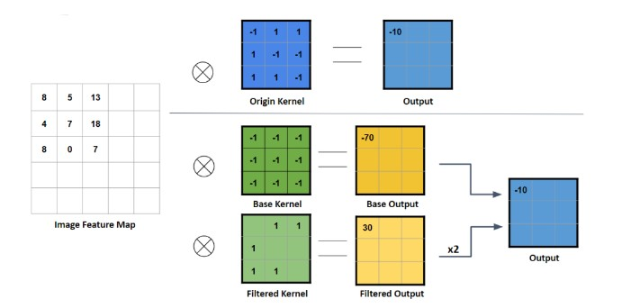
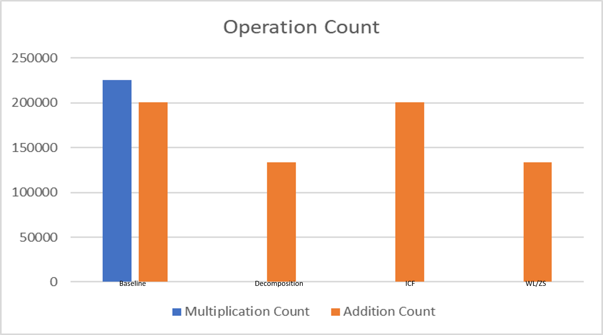
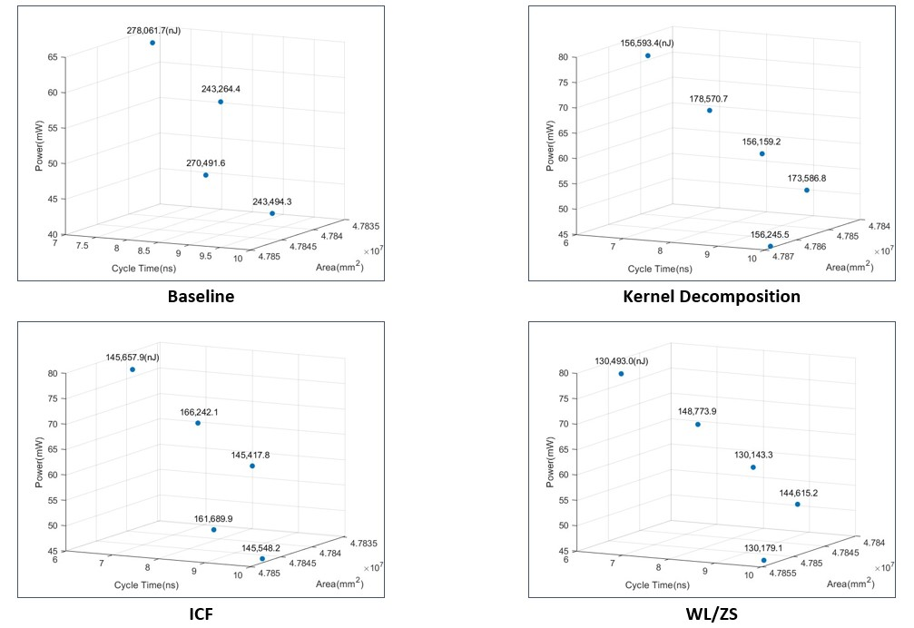

# A-Shared-Kernel-Software-Hardware-Codesign-Based-on-Binary-Convolutional-Neural-Networks

112 資工系專題展

## 介紹
現今社會對於影像辨識的運算需求大幅提升,且可攜式裝置的使用量增加,傳統卷積神經網路需要大量的運算且帶來較高的功耗,較不適合可攜式裝置,所以我們參考深度學習最佳化電路的相關論文後,採用卷積核分解(Kernel Decomposition)的方法,來實現 MNIST 手寫數字辨識,並額外提出兩種基於卷積核分解的硬體實作方法:
1. Weight Lookahead with Zero Skipping(WL/ZS)在卷積核分解的計算過程中,跳過值為零的權重來加速運算,能夠在不大幅增加晶片面積的情況下降低運算量進而降低功耗。
2. Image Compute Fusion(ICF) 在卷積核分解的計算過程中將 Base Kernel 的計算融合到各個 Filter Kernel 中,此方法能後在更小的晶片面積下加快執行時間。

## 實作流程
我們的實作流程是使用 Keras 訓練二進位卷積神經網路(BNN)模型,之後將 MNIST 資料集的數字影像轉換為 16 進位的定點數表示法,之後用 Python 模擬卷積核分解中加法及乘法的運算次數,在實作硬體前預測相較於傳統的計算方式,此方法可以減少多少的運算量。我們用 Verilog 搭配軟體端的資料來實作卷積核分解的電路,並使用 WL/ZS 方法實現低運算量及低功耗,或是使用 ICF 以實現降低面積和加快執行時間,最後將運算完的資料輸出至 Test Bench 檔以驗證答案

卷積核分解的方法是將二值化神經網路權重中的-1 的部分改為 0,形成 Filter Kernel,並且創建一個所有權重都是-1 的 Base Kernel。卷積運算時擷取部分輸入特徵,再分別將其與 Base Kernel、Filter Kernel 做卷積運算,並將分別得到的結果相加,即可得到該位置卷積運算的結果。

operation-count.png

## 測試結果
我們使用 Python 模擬各個方法中加法及乘法的運算次數。從左圖可以看到除了傳統卷積的電路外,其他的電路都沒有乘法的運算,因為 BNN 搭配卷積核分解可以用加法取代乘法運算。另外兩種基於卷積核分解的硬體實作方法中,ICF 運算次數較多的原因是它沒有使用 Base Kernel,所以在少了Base Kernel 的輔助下,每次都需要完整的計算一遍,因此可以其加法次數跟傳統卷積(Baseline)一樣。

下圖中所標示的數值為該點在特定 cycle time(ct)下的總能耗,透過以上四張 PPA 圖,我們可以發現,在不同的 ct 時,我們所提出的 ICF 和 WL/ZS 這兩種電路都可以在不大幅增加晶片面積的情況下,在總能耗的數值上勝過傳統卷積及卷積核分解的版本。

